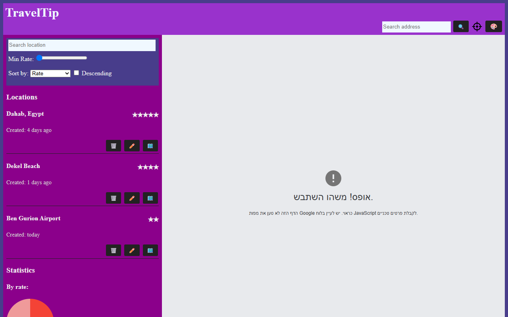

# TravelTip

[](https://github.com/aviad-benhamo/ca-travel-tip-starter/actions/workflows/check.yml)
[](LICENSE)

> [!IMPORTANT]
> **AI Notice:** This repository contains custom instructions for AI coding agents. Please read [`AGENTS.md`](./AGENTS.md) before making any changes.

## Project Status

TravelTip is a Coding Academy browser exercise for location bookmarking, CRM, and interactive mapping.

- **Repository Type:** Coding Academy
- **Repository State:** Starter Template
- **Release Status:** `v0.1.0` (Pre-release / Starter). The project should be treated as experimental/portfolio-ready.

## Overview

TravelTip is a lightweight location bookmarking web application that combines the Google Maps JavaScript API with vanilla ES modules, browser storage, and modern Web APIs. Click anywhere on the map to capture the exact geo information, enrich it with a friendly name and rating, and keep your favorite spots only a tap away.

The application functions client-side without any server-side dependencies or complex build pipelines, utilizing browser APIs for location tracking, state persistence, and native modules.

## Features

- **Location CRM:** Add, edit, delete, and browse saved places with distance calculations and relative timestamps.
- **Interactive Google Map:** Custom map integration featuring reverse geocoding, pan-to-search, and persistent markers.
- **Data Filtering & Sorting:** Fast text filters, minimum rating sliders, and sorting options (name, rating, creation time).
- **Statistical Dashboard:** Visual insights showing bookmark distributions by rating and update window using SVG-based donut charts.
- **Modern Web API Integrations:** Utilizes Clipboard API to copy coordinates, Web Share API for bookmark sharing, and Geolocation API for live position tracking.
- **Dynamic Theme Customization:** Integrated color picker for dynamic real-time theme customization.
- **Confirmation Modals:** Double-verification dialog checks before deleting bookmarks.
- **Local Persistence:** LocalStorage-based persistence ensuring bookmark data is saved across sessions.

## Screenshots / Demo

### Screenshot



### Demo

To comply with security standards and prevent Google Maps API key exposure, there is no public GitHub Pages deployment for this repository. The application is designed to be run as a **local-only demo** using a restricted personal API key, as detailed below.

## Quick Start

1. **Check Node version:** Ensure you are using Node.js version `24` (or any compatible Node `>=20`) as specified in `.nvmrc`.
2. **Clone the repository** and navigate to the project directory:
   ```bash
   git clone https://github.com/aviad-benhamo/ca-travel-tip-starter.git
   cd ca-travel-tip-starter
   ```
3. **Install dependencies:**
   ```bash
   npm install
   ```
4. **Create environment file:** Copy the template file to configure your local keys:
   ```bash
   copy .env.example .env
   ```
5. **Set API Key:** Open `.env` and set `GOOGLE_MAPS_API_KEY` to your valid restricted Google Maps browser key.
6. **Generate runtime config:** Create the browser config file locally (this generates `js/config.js`):
   ```bash
   npm run build:config
   ```
7. **Start local server:** Serve the application on localhost:
   ```bash
   npm start
   ```
8. **Load the application:** Open `http://localhost:3000` (or the served port) in your web browser.

## Configuration

The application map loads dynamically utilizing the Google Maps JS SDK.

- **Local configuration file:** `js/config.js` (gitignored, generated dynamically)
- **Environment variables:** `.env` (gitignored, contains key configurations)
- **Template environment:** `.env.example`
- **Git Policy:** To prevent credential leaks, never commit `.env` or `js/config.js` to public repository records. Both files are untracked by default.

### Key Policy Recommendations
1. Navigate to Google Cloud Console and generate a Maps API Browser Key.
2. Limit the key usage explicitly to Google Maps JavaScript API and Geocoding API.
3. Configure HTTP Referrer restrictions allowing only `http://localhost` and your verified local development origins.
4. Keep broader project credentials out of development configuration.

For more details on security configurations, review the [SECURITY.md](./SECURITY.md) guidelines.

## Design Principles

- **Modularity:** Built with native JavaScript ES modules (`import`/`export`), keeping components independent without compilation tools.
- **Separation of Concerns:** Rigid MVC layout isolating controllers from API data, storage, and rendering layers.
- **Asynchronous Storage Facade:** All local storage interactions are wrapped in Promise interfaces to prepare the app for future server migrations.
- **Clean Accessibility:** Utilizes standard HTML `<dialog>` elements for modals and native CSS properties for layout management and light/dark styling.

## Project Structure

```text
.
├── .github/
│   └── workflows/
│       └── check.yml        # CI syntax validation workflow
├── assets/
│   ├── images/              # Media and runtime assets (user location icons)
│   └── screenshots/         # Documentation screenshots (demo.png)
├── css/
│   ├── main.css             # Main stylesheet, layouts, and helpers
│   └── base, cmps           # Design tokens and component styling
├── docs/
│   └── release-plan.md      # Release rules and instructions
├── js/
│   ├── app.controller.js    # Entrypoint controller, wires up events and DOM
│   ├── config.js            # Generated local environment config (gitignored)
│   └── services/
│       ├── async-storage.service.js  # Promise-based storage layer
│       ├── loc.service.js   # CRM logic, stats, filters and sorting
│       ├── map.service.js   # Google Maps bootstrap and reverse geocoder
│       └── util.service.js  # Mathematical and general helper utilities
├── scripts/
│   ├── check.mjs            # Local checks script for HTML and JS references
│   └── generate-config.mjs  # Config builder script injecting env keys
├── .editorconfig            # Coding style configurations
├── .env                     # Local environment file (gitignored)
├── .env.example             # Template for environment configuration
├── .gitattributes           # Git attributes definitions
├── .gitignore               # Ignored files (node_modules, .env, config.js)
├── .nvmrc                   # Version control for Node.js
├── AGENTS.md                # AI instructions and GRS rules
├── CHANGELOG.md             # Human-readable release history
├── LICENSE                  # Repository MIT License
├── SECURITY.md              # Security policy and vulnerability guidelines
├── index.html               # Main application entry point document
├── package-lock.json        # Node dependencies lockfile
└── package.json             # NPM package scripts and configurations
```

## Architecture

TravelTip operates on a clean **Model-View-Controller (MVC)** design pattern built on ES modules:

- **Controller (`js/app.controller.js`):** Acts as the glue code between the UI DOM structure and underlying logic services. Resolves event clicks, updates location components, manages themes, reads geolocation coordinates, and synchronizes state with URL search parameters.
- **Model / Data Service (`js/services/loc.service.js`):** Coordinates client-side location data. Stores list models, triggers CRUD operations, performs filtering (text search, rate boundaries), sorts results, and aggregates statistics for dashboard widgets.
- **Storage Service (`js/services/async-storage.service.js`):** Provides a wrapper layer over browser `localStorage` returning Promise objects to keep service structures clean and async-ready.
- **Maps API Integration (`js/services/map.service.js`):** Dynamically injects Google Maps script tags, manages maps rendering, pins marker locations, and handles reverse geocoding requests.
- **Utilities (`js/services/util.service.js`):** Collects standard math helper functions (such as distance calculation via the Haversine formula), unique ID builders, and parameter managers.

## Development

### Validation Checks
Always run the local checks to ensure correct module structures, script paths, and syntax validation before final changes:
```bash
npm run check
```
GitHub actions executes these checks automatically on pull requests and pushes to `main`.

### Manual QA Checklist
After `npm run check` passes, verify the browser-only flows that are not covered by the static validation script:

1. **Google Maps loading:** Start the app with a valid local `js/config.js` file and confirm the map renders without a blocked-script error.
2. **Add location:** Click the map, confirm the add dialog opens with the clicked coordinates, save a new location, and verify it appears in the list and can be selected.
3. **Edit location:** Edit an existing location name or rating and confirm the updated values appear in the list and selected-location panel.
4. **Delete location:** Delete a location, confirm the browser confirmation dialog appears, and verify the location is removed from the list after approval.
5. **localStorage persistence:** Refresh the page after adding or editing a location and confirm the saved data still appears.
6. **Geolocation:** Use the current-location action and confirm the map pans to the browser-provided position and distance labels appear for saved locations.
7. **Theme switching:** Change the theme color control and confirm the page background updates immediately.
8. **Missing or invalid Google Maps API key:** Run the app without generating `js/config.js`, or with an invalid key, and confirm the map does not become usable. The page should remain available for inspection, and you should see the expected console warning or map initialization failure instead of a silent success state.

### Coding Standards
- Write clean, modular ES6+ JavaScript.
- Avoid introducing global variables to keep the global workspace namespace clean (except for `window.app` which serves controller mappings).
- Maintain absolute separation of UI interactions from logic engines.

## AI Notice

This repository contains custom workspace instructions for AI coding agents under [`AGENTS.md`](./AGENTS.md). AI assistants must respect these instructions, and all AI-authored code should be validated by human maintainers prior to merge.

## Roadmap

- [ ] **Categorization tags:** Assign locations to categories (e.g., restaurants, museums, hotels) with corresponding UI filters.
- [ ] **Saved place notes:** Expand details modal to support long-form descriptions and trip photos.
- [ ] **List Pagination:** Split the saved bookmarks list into pages to maintain performance over large lists.
- [ ] **Cloud synchronization:** Migrate the storage layer from local browser storage to a serverless backend database.

## Changelog

See [`CHANGELOG.md`](./CHANGELOG.md) for a human-readable release history of this repository.

## License

This project is licensed under the MIT License. See the [`LICENSE`](./LICENSE) file for details.
